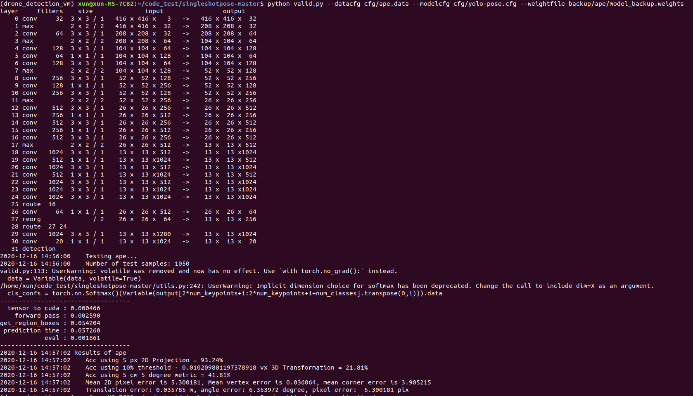

## 12.13

paper note: 
add pub key to github.com

## 12.14
install anaconda3 and cuda-11.1(not finished)
read the paper(Real-Time Seamless Single Shot 6D Object Pose Prediction)

## 12.15
system crashed and reinstalled it
use conda create a virtual env and install some packages

## 12.16
finish the configuration of the virtual environment
download the data needed for  test
test the single object recognition(the result in test_rest.dot)
valid_multi.py has some problem with loading weigts file etc
next few days I will go back to school for classes
when I go back to the lab, I will try to solve the loading problem.

## 12.21

完成了bounding box的绘制

## 12.22

本文数据集的标注

1. 获得3D bouding box  本文使用LINEMOD数据集提供的3D object model得到的
2. 定义3D bounding box的8个角和形心，8个corner的坐标为[[min_x, min_y, min_z], [min_x, min_y, max_z], [min_x, max_y, min_z], [min_x, max_y, max_z], [max_x, min_y, min_z], [max_x, min_y, max_z], [max_x, max_y, min_z], [max_x, max_y, max_z]]，形心坐标为[0,0,0]
3. 将3D关键点投影到2D，需要用到相机的内在校准矩阵，以及真实的旋转和平移。旋转和平移需要自己设法测量，文章作者给的提示参见这篇 [paper](http://cmp.felk.cvut.cz/~hodanto2/data/hodan2017tless.pdf)的3.1节，但感觉对无人机不适用
4. 计算围绕物体的2D rectangle box，本文通过拟合一个紧紧包含8个corner投影点的rectangle来获得2D box
5. 制作label。本文label长度为21，第一个是class label，后面9对是形心和8个corner的坐标，最后两个是x和y的变化范围（即坐标中最大值与最小值差）