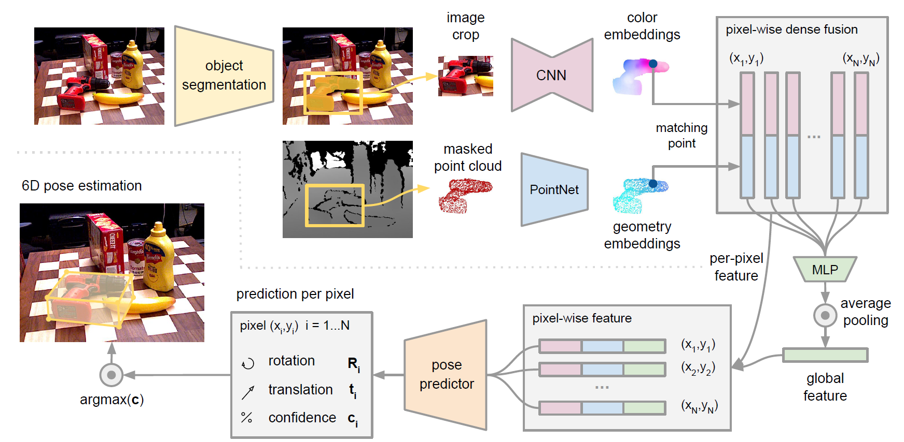
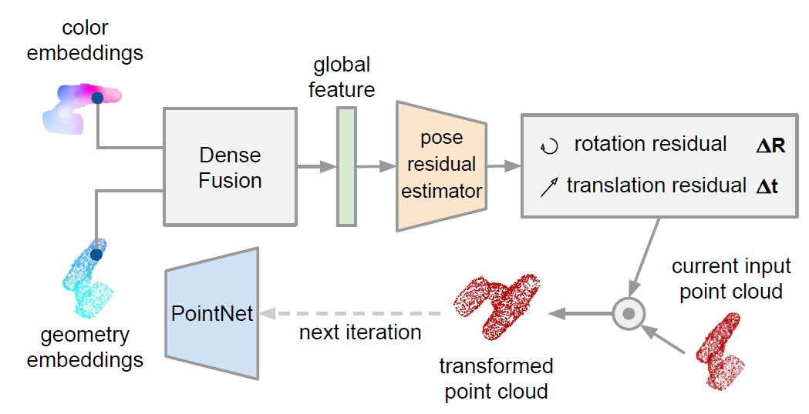

# 搞龙的工作记录

## 12.17

下载并阅读DenseFusion论文，论文笔记如下：

### 一、概要

DenseFusion的两大创新：

1.提出基于像素级的RGB和点云融合的6D位姿估计方法，改善以往算法在重度遮挡的情况下效果差的缺陷；

2.一个基于神经网络的迭代优化器，能改善以往算法利用后处理ICP导致实时性差的缺陷。

### 二、模型

主网络示意图如下：

#### （一）图像分割/目标检测

利用已有的目标检测网络，获取图像ROI，裁剪后输出。（利用已存在的6D位姿估计网络PoseCNN中的目标检测模块，是一种利用RGB信息的卷积神经网络）

#### （二）特征提取与融合

1.对于ROI的RGB信息，采用全卷积层（CNN），每一个像素对应一个RGB特征输出；

2.对于ROI的点云信息，采用基于PointNet的网络（将最大池化改成了平均池化），每一个像素对应一个几何特征输出；

3.分别将每个像素的RGB特征和几何特征做连接后，全部输入到一个“多层感知机+平均池化”网络，获得全局特征；

4.将获得的全局特征与每一个像素特征做连接，每个像素得到一个三段的特征。

#### （三）位姿估计与输出

参考了PointFusion的机制，一种从RGB信息和点云信息，像素级的3D对象检测模型。

1.将每个像素对应的特征输入到一个位姿估计网络，输出除了R、t外，还有该像素估计的置信度；

2.损失函数：

(1) 每个像素估计的损失分为不对称物体情况和对称物体情况，公式如下：
$$
L_i^p=\frac{1}{M}\sum\limits_{j}||(R_ix_j+t)-(\hat{R}_ix_j+\hat{t_i})||\ \ \ \ (不对称情况)
$$

$$
L_i^p=\frac{1}{M}\sum\limits_{j}\min\limits_{j\le k\le M}||(R_ix_j+t)-(\hat{R}_ix_k+\hat{t_i})||\ \ \ \ (对称情况)
$$

(2)总体损失将置信度和像素损失结合，训练的时候让置信度不能拉太低，公式如下：
$$
L=\frac{1}{N}\sum\limits_{i}(L_i^pc_i-wlog(c_i))
$$

#### （四）附网络

迭代优化器类似循环神经网络，示意图如下：

##### 1.位姿残差估计器

利用DenseFusion估计的结果对点云做变换，作为该网络的点云输入，RGB输入与DenseFusion输入相同。通过一个该网络，输出残差矩阵ΔR和Δt。对输入点云做变换后作为下一次该迭代过程的点云输入。

##### 2.注意事项

可以和主网络联合训练，但是一开始DenseFusion输出的噪声居多，使用时应当等DenseFusion收敛后再开始训练。结果上看，这个网络对准确率提高非常关键。

### 三、实验

用广泛数据集LineMOD和广泛的现有算法比较，用YCB-Video Dataset数据集展示模型抗遮挡能力和对不同纹理、形状对象的适用性。总的来说，效果很不错。

## 12.18

成功安装双系统（Ubuntu18.04），并成功安装英伟达显卡驱动。

### 注意事项：

Ubuntu18.04在分配空间的时候，保险起见，除了"\boot"外还得分配"\efi"，上述两个，我各分配的200M。前者作为启动导引器位置（但貌似没用？用efi就可以开机进bios选了）。

NVIDIA驱动直接进入设置界面，选择使用最新的驱动，自动安装。重启后进入MOK选择界面，再做相应设置即可，无需命令行禁止nouveau。

## 12.19

成功安装Cuda9.0和cuDNN7.6.5。

### 注意事项：

下载速度慢的情况下，建议翻墙。Ubuntu18.04装Cuda9.0要降级gcc，测试的时候不能忘记手动ldconfig添加动态链接库。